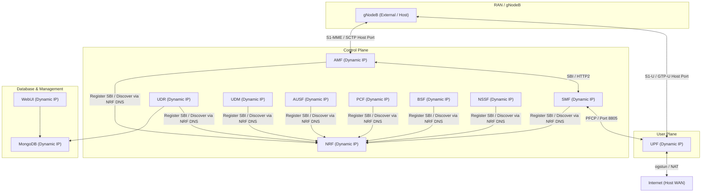

# Open5GS Deploy

A containerized, multi-service deployment of the **Open5GS** 5G Core (5GC) using **Docker** and **Docker Compose**. 

This deployment isolates each Network Function (NF) into its own container, uses **Docker DNS** for dynamic service discovery, automatically templates configurations at runtime, and allows **multiple concurrent environments** to run side-by-side on the same host without configuration changes.

---

## Table of Contents

- [Architecture](#architecture)
- [Features](#features)
- [Prerequisites](#prerequisites)
- [Environment Configuration (.env)](#environment-configuration-env)
- [Configuration & Compose Versioning](#configuration--compose-versioning)
- [Automated Subscriber Provisioning](#automated-subscriber-provisioning)
  - [PCF Local Policy (Internet DNN)](#4-pcf-local-policy-internet-dnn)
  - [User Plane Subnet & Gateway Architecture](#5-user-plane-subnet--gateway-architecture)
- [Quick Start](#quick-start)
- [Running Multiple Stacks Simultaneously](#running-multiple-stacks-simultaneously)
- [Managing Subscribers via WebUI](#managing-subscribers-via-webui)
- [UERANSIM Integration](#ueransim-integration)
- [Stop & Clean Up](#stop--clean-up)

---

## Architecture

Instead of relying on rigid, hardcoded IP addresses, this architecture uses Docker Compose's built-in DNS aliases. Docker allocates dynamic subnet ranges for each stack, and the containers self-orchestrate on startup using a DNS resolution wait-loop in the entrypoint.



---

## Features

- **Microservices-based**: Every Open5GS Network Function runs in its own container.
- **Optimized Multi-Stage Build**: Staged Docker build that compiles Open5GS from source and discards compilation tools in the final runtime stage, keeping container images extremely lightweight.
- **Switchable & Versioned Configuration**: Build and switch between arbitrary Open5GS versions (e.g. `v2.7.2`, `v2.6.6`) by changing variables in the `.env` file. Both configuration files, the entrypoint runner, and `docker-compose.yml` are versioned side-by-side.
- **Dynamic IP Assignment**: Docker manages and assigns host network subnets dynamically. No hardcoded static subnetting required.
- **DNS-Based Self-Orchestration**: Components query Docker DNS at startup to locate NRF and UPF. The entrypoint halts boot until required endpoints are resolvable, preventing race conditions or crash loops.
- **Multiple Concurrent Stacks**: You can run multiple instances of the Open5GS core at the same time by configuring a custom project name (`-p`), mapping host ports, and isolating container logs.
- **Automated User Plane Setup**: The UPF entrypoint script automatically initializes the `ogstun` tunnel device and configures NAT (MASQUERADE) rules so that Connected Devices (UEs) can access the external internet.
- **Automated Subscriber Provisioning**: Programmatically seed database entries for SIM cards / User Equipment (UEs) at container boot.
- **Persistent DB & Logs**: MongoDB data is persisted via Docker volumes, and all network function logs are saved to host directory paths.

---

## Prerequisites

1. **Docker and Docker Compose**:
   - Docker Engine >= 22.0.5
   - Docker Compose >= 2.14

2. **SCTP Kernel Module** (for AMF connectivity):
   Ensure that the SCTP kernel module is loaded on your host machine:
   ```bash
   sudo modprobe sctp
   ```

3. **TUN Kernel Module** (for UPF connectivity):
   Make sure the TUN driver is active:
   ```bash
   sudo modprobe tun
   ```

### Pre-flight System Verification
You can run the included pre-flight check script to automatically verify all system requirements, kernel modules, and environment setup:
```bash
./check-prereqs.sh
```

---

## Environment Configuration (.env)

A template of all variables is available in [env.sample](file:///home/hal9000/dev/open5gs-deploy/env.sample). Copy it to `.env` to configure your environment:
```bash
cp env.sample .env
```

Below is a detailed mapping of all configurable variables:

| Variable | Default Value | Purpose / Description |
| :--- | :--- | :--- |
| `OPEN5GS_VERSION` | `v2.7.2` | Git tag/version of the Open5GS codebase to clone, build, and use. |
| `MONGODB_VERSION` | `6.0` | Container image tag of the MongoDB database service. |
| `MONGODB_PORT` | `27017` | Host port mapped to the MongoDB server instance. |
| `AMF_NGAP_PORT` | `38412` | Host port mapped to the AMF service for SCTP gNodeB control plane connection. |
| `UPF_GTPU_PORT` | `2152` | Host port mapped to the UPF service for UDP user plane user-data traffic. |
| `WEBUI_PORT` | `9999` | Host port mapped to the Open5GS Web Administration UI. |
| `LOGS_DIR` | `./logs` | Host directory location where container log files will be persisted. |
| `LOG_LEVEL` | `info` | Logging level of the Open5GS NFs (e.g. `info`, `debug`, `trace`, `warn`, `error`). |
| `MCC` | `999` | Mobile Country Code configured in the AMF PLMN settings. |
| `MNC` | `70` | Mobile Network Code configured in the AMF PLMN settings. |
| `TAC` | `1` | Tracking Area Code configured in the AMF settings. |
| `SST` | `1` | Slice/Service Type (SST) value for the default 5G network slice. |
| `SD` | `000001` | Slice Differentiator (SD) hex value for the default 5G network slice. |
| `DB_URI` | `mongodb://mongodb:27017/open5gs` | MongoDB URI connection string used by NFs (PCF, UDR) and provisioning scripts. |
| `PROVISION_SUBSCRIBERS` | `false` | Set to `true` to enable automatic subscriber provisioning in the database at boot. |
| `UE_SUBNET` | `10.45.0.0/16` | IPv4 address allocation range mapped to mobile user equipment devices. |
| `UE_GATEWAY` | `10.45.0.1` | Gateway IP address assigned to the UPF tunnel interface (`ogstun`). |

---

## Configuration & Compose Versioning

Since different versions of Open5GS can introduce new network functions (NFs) or change configuration schemas, all components are versioned inside the [versions/](versions/) directory:

- `versions/default/`: Holds the default baseline configurations, the core templates, the template substitution `entrypoint.sh` script, and `docker-compose.yml`.
- `versions/<VERSION>/`: Holds overrides or custom files specific to a target Open5GS release.
  - To avoid duplicating configurations, symbol links are supported. For example, `versions/v2.7.2` is a Git symbolic link pointing to `versions/default`.
- **Dockerfile copy & fallback**: The Docker build process checks if `versions/${OPEN5GS_VERSION}` exists in the context:
  - If yes, it copies the version-specific configurations and scripts into the image layer (dereferencing symbolic links).
  - If no, it automatically falls back to `versions/default/` baseline configs.
- **Root docker-compose.yml**: The `docker-compose.yml` file at the root of the project is a symbolic link pointing to `versions/default/docker-compose.yml`. It uses variable evaluation (`${COMPOSE_CONTEXT:-.}`) to build and reference paths correctly relative to the project root directory context.

---

## Automated Subscriber Provisioning

You can auto-provision subscribers (UEs) into the database on startup rather than entering them manually via the WebUI.

### 1. Enable Provisioning
Set the environment parameter inside your `.env` file:
```env
PROVISION_SUBSCRIBERS=true
```

### 2. Define Custom Subscribers (Optional)
Create a `subscribers.json` file and place it inside the configuration templates folder (e.g. `versions/default/config/subscribers.json` or bind-mounted into `/open5gs/config/subscribers.json`).

Here is a sample structure for `subscribers.json`:
```json
[
  {
    "imsi": "999700000000001",
    "subscribed_rau_tau_timer": 12,
    "subscriber_status": 0,
    "access_restriction_data": 32,
    "security": {
      "k": "465B5CE8B199B49FAA5F0A2EE238A6BC",
      "amf": "8000",
      "opc": "E8ED289DEBA952E4283B54E88E6183CA"
    },
    "slice": [
      {
        "sst": 1,
        "sd": "000001",
        "default_indicator": true,
        "session": [
          {
            "name": "internet",
            "type": 3,
            "pcc_rule": [],
            "qos": {
              "index": 9,
              "arp": {
                "priority_level": 8,
                "pre_emption_capability": 1,
                "pre_emption_vulnerability": 1
              }
            },
            "ambr": {
              "uplink": { "value": 1, "unit": 3 },
              "downlink": { "value": 1, "unit": 3 }
            }
          }
        ]
      }
    ]
  }
]
```

### 3. Fallback Provisioning
If `PROVISION_SUBSCRIBERS` is set to `true` but **no** custom `subscribers.json` configuration is defined in the configuration folder, the system automatically falls back to provisioning a default subscriber matching your `.env` settings:
- **IMSI**: `${MCC}${MNC}000000001` (e.g., `99970000000001` with default settings).
- **AMBR Speed**: 1 Gbps DL / 1 Gbps UL.
- **Keys**: Standard test SIM keys (`K`, `OPc`, `AMF`) and matching network slice (`SST`, `SD`).

### 4. PCF Local Policy (Internet DNN)
To ensure reliable session establishment and prevent Policy Control Function (PCF) crashes, the PCF is configured with a local policy block in `pcf.yaml` for the `internet` DNN. 

By default, when a UE registers, the PCF queries the UDR for Access and Mobility policy data from MongoDB. If no policy documents are defined in the UDR MongoDB collections, the query returns an empty response, causing a crash in the PCF. 

Defining a static local policy block directly inside `pcf.yaml` bypasses the UDR database queries and serves the policy parameters locally:
*   **PLMN ID**: Dynamically generated using `MCC` and `MNC` from your `.env` file.
*   **Slice Profile**: Configured to match your `SST` and `SD` variables.
*   **DNN / APN**: Dedicated for the `internet` profile with 1 Gbps uplink and downlink AMBR limits.

This configuration is automatically templetized and applied during container startup.

### 5. User Plane Subnet & Gateway Architecture
To enable seamless mobile data routing and internet access for connected User Equipments (UEs):
* **Gateway & IPAM Reservation**: Both the **SMF** (`smf.yaml`) and **UPF** (`upf.yaml`) session blocks are configured with `gateway: {{UE_GATEWAY}}`. This instructs SMF IP Address Management (IPAM) to reserve the gateway address (`10.45.0.1`) and allocate client IPs starting from `10.45.0.2` onwards.
* **Automatic CIDR Formatting**: The UPF entrypoint automatically formats the `ogstun` TUN interface with the CIDR netmask matching `UE_SUBNET` (`10.45.0.1/16`). This ensures Linux in-kernel routing forwards ICMP/IP packets between `10.45.0.1` and client UEs (`10.45.0.x`).
* **NAT / MASQUERADE**: Outbound traffic from the `UE_SUBNET` range is automatically translated (MASQUERADED) by `iptables` out of the UPF container's WAN interface to external destinations (e.g. `8.8.8.8`).

---

## Quick Start

### 1. Configure Environment Variables
Copy the sample environment file to `.env` and customize it as needed:
```bash
cp env.sample .env
```

### 2. Build & Launch the Stack
Start all network functions in the background:
```bash
docker compose up --build -d
```

### 3. Verify Services are Running
Check container status:
```bash
docker compose ps
```

---

## Running Multiple Stacks Simultaneously

You can run multiple isolated instances of the Open5GS core concurrently on the same host machine by specifying a custom Docker Compose project name (`-p`), overriding host port bindings, and defining a dedicated log directory to prevent file lock conflicts. 
The below strategies can be used to spins up an isolated `open5gs-alt` stack sharing the same base container image (`open5gs-deploy:${OPEN5GS_VERSION}`), but running isolated containers, network interfaces, database volumes, and host ports.

### **Testing Setup 1: Via Host Port Mapping (Distinct Port Allocation)**

When connecting external gNodeB/UE simulators (e.g. UERANSIM on host OS) or browser clients without direct container IP routing, Docker defaults to binding ports across all host network interfaces (`0.0.0.0`). 

To prevent `address already in use` port collisions on `0.0.0.0`, allocate distinct host ports for each concurrent stack:

```bash
# Start a secondary stack ("open5gs-alt") with distinct host ports and log folder
MONGODB_PORT=27018 \
AMF_NGAP_PORT=38413 \
UPF_GTPU_PORT=2153 \
WEBUI_PORT=9998 \
LOGS_DIR=./logs-alt \
docker compose -p open5gs-alt up -d
```

### **Testing Setup 2: Via Direct Container IP Routing (Loopback Isolation)**

When test tools, containerized gNodeBs, or virtual routers communicate directly with container IPs (`172.18.0.x`) within Docker bridge networks, exposing ports on all host interfaces (`0.0.0.0`) is unnecessary.

You can restrict port exposure to specific host loopback addresses (e.g. `127.0.0.2`, `127.0.0.3`) via environment overrides. This allows running multiple stacks on the **same port numbers** without port conflicts or external WAN exposure:

```bash
# Bind secondary stack ports exclusively to a local loopback interface (127.0.0.2)
MONGODB_PORT=127.0.0.2:27017 \
AMF_NGAP_PORT=127.0.0.2:38412 \
UPF_GTPU_PORT=127.0.0.2:2152 \
WEBUI_PORT=127.0.0.2:9999 \
LOGS_DIR=./logs-alt \
docker compose -p open5gs-alt up -d
```

---

## Managing Subscribers via WebUI

If you prefer to manage subscribers manually, the WebUI is accessible from your browser:
* **URL**: `http://localhost:9999` (or `http://localhost:9998` for the alternative stack)
* **Default Username**: `admin`
* **Default Password**: `1423`

### Adding a Subscriber manually
1. Go to the **Subscriber** menu.
2. Click **Add Subscriber**.
3. Input the IMSI, K, OPC/OP, and APN config matching your SIM card / UE profile.
4. Select the slice parameters (**SST** and **SD**) matching your network settings (configured in `.env`).
5. Save the subscriber.

---

## UERANSIM Integration

**UERANSIM** is an open-source 5G RAN and UE simulator. You can connect it directly to this containerized Open5GS deploy stack using the mapped host ports.

### 1. gNodeB Configuration
Configure your UERANSIM gNodeB template (e.g. `open5gs-gnb.yaml`) to point to the host IP address where Docker is running.

```yaml
mcc: '999'          # Must match MCC in .env
mnc: '70'           # Must match MNC in .env
nci: '0x000000010'
idLength: 32
tac: 1              # Must match TAC in .env
ignoreStreamIds: true

# Local IP address of the gNodeB for NGAP (Control Plane) and GTP-U (User Plane)
linkIp: 192.168.1.100  # Replace with UERANSIM host IP
ngapIp: 192.168.1.100  # Replace with UERANSIM host IP
gtpIp: 192.168.1.100   # Replace with UERANSIM host IP

# AMF IP address and NGAP port (mapped to host)
amfConfigs:
  - address: 172.18.0.42    # Replace with Open5GS AMF host IP / Or Open5GS Host IP (docker forwarding)
    port: 38412             # Must match AMF_NGAP_PORT in .env

# Slices configured in AMF
slices:
  - sst: 1            # Must match SST in .env
    sd: 0xffffff      # Must match SD in .env (in hex format)

# Cell access type. When set to one of the satellite types (nr-leo, nr-meo,
# nr-geo, nr-othersat), the gNB attaches the NR-NTN TAI Information extension
# to every UserLocationInformationNR it sends to the AMF. Defaults to "nr".
cellAccessType: nr

# Indicates whether or not SCTP stream number errors should be ignored.
ignoreStreamIds: true

```

### 2. UE Configuration
Configure your simulated UE template (e.g. `open5gs-ue.yaml`) to register with the gNodeB and request a session.

```yaml
supi: 'imsi-999700000000001'            # Must match provisioned IMSI
mcc: '999'                              # Must match MCC in .env
mnc: '70'                               # Must match MNC in .env
key: '465B5CE8B199B49FAA5F0A2EE238A6BC' # Must match SIM Key
op: 'E8ED289DEBA952E4283B54E88E6183CA'  # Must match OPc Key
opType: 'OPC'                           # Must be OPC or OP
amf: '8000'                             # Must match AMF configuration
protectionScheme: 0                     # SUCI Protection Scheme : 0 for Null-scheme, 1 for Profile A and 2 for Profile B
routingIndicator: '0000'
imei: '356938035643803'                 # IMEI number of the device. It is used if no SUPI is provided
imeiSv: '4370816125816151'              # IMEISV number of the device. It is used if no SUPI and IMEI is provided

# Configured gNodeB link IP
gnbSearchList:
  - 192.168.1.100 # Replace with UERANSIM host IP

# Initial PDU sessions to be established, configured DNN / APN profile
sessions:
  - type: 'IPv4'
    apn: 'internet'
    slice:
      sst: 1
      sd: 0xffffff

# Configured NSSAI for this UE by HPLMN
configured-nssai:
  - sst: 1
    sd: 0xffffff

# Default Configured NSSAI for this UE
default-nssai:
  - sst: 1
    sd: 0xffffff

# Integrity and Ciphering Algorithms
integrity:
  IA0: true
  IA1: true
  IA2: true
  IA3: true
ciphering:
  EA0: true
  EA1: true
  EA2: true
  EA3: true

# Integrity and Ciphering Max Rates
integrityMaxRate:
  uplink: 'full'
  downlink: 'full'
cipheringMaxRate:
  uplink: 'full'
  downlink: 'full'

# Unified Access Control (UAC) Settings
uacAic:
  mps: false
  mcs: false
uacAcc:
  normalClass: 0
  class11: false
  class12: false
  class13: false
  class14: false
  class15: false
```

### 3. Startup and Connectivity
1. Start the gNodeB process:
   ```bash
   ./nr-gnb -c open5gs-gnb.yaml
   ```
2. Start the UE process:
   ```bash
   ./nr-ue -c open5gs-ue.yaml
   ```
   On successful connection, UERANSIM will create a virtual network interface `uesimtun0` on the UE host machine.
3. Test internet connectivity through the Open5GS UPF NAT gateway:
   ```bash
   ping -I uesimtun0 google.com
   ```

### 4. Running UERANSIM on the Same Host (Port 2152 Conflict)
If UERANSIM gNodeB and containerized Open5GS run on the **same physical host**, they will conflict on UDP port `2152` (used for GTP-U). By default, Docker binds to `0.0.0.0:2152`, preventing UERANSIM from binding to the same port on the host.

**To resolve this, bind Docker to loopback (127.0.0.1) and UERANSIM to your host IP:**

1. Modify your `.env` file (or pass it as an environment override) to bind the Docker UPF GTP-U port to loopback only:
   ```env
   # Map UPF GTP-U to host loopback IP only to avoid conflict
   UPF_GTPU_PORT=127.0.0.1:2152
   ```
2. Configure UERANSIM gNodeB (`open5gs-gnb.yaml`) to bind to your host IP (e.g. `192.168.1.100`):
   ```yaml
   linkIp: 192.168.1.100  # Your actual host IP
   ngapIp: 192.168.1.100  # Your actual host IP
   gtpIp: 192.168.1.100   # Your actual host IP

   amfConfigs:
     - address: 192.168.1.100  # Your actual Host IP (Open5GS Host IP - docker port forwarding)
       port: 38412
   ```

This allows both processes to bind to port `2152` simultaneously on different IP interfaces.

---

## Stop & Clean Up

To bring down the default stack and clean up its dynamic networks:
```bash
docker compose down
```

To stop a specific alternative stack:
```bash
docker compose -p open5gs-alt down -v
```
