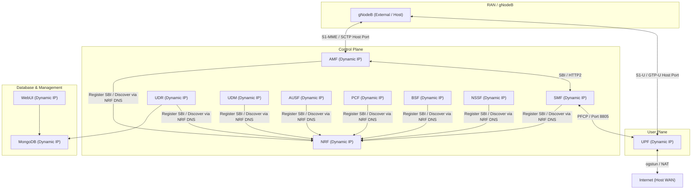

# Open5GS Deploy

A containerized, multi-service deployment of the **Open5GS** 5G Core (5GC) using **Docker** and **Docker Compose**. 

This deployment isolates each Network Function (NF) into its own container, uses **Docker DNS** for dynamic service discovery, automatically templates configurations at runtime, and allows **multiple concurrent environments** to run side-by-side on the same host without configuration changes.

---

## Architecture

Instead of relying on rigid, hardcoded IP addresses, this architecture uses Docker Compose's built-in DNS aliases. Docker allocates dynamic subnet ranges for each stack, and the containers self-orchestrate on startup using a DNS resolution wait-loop in the entrypoint.



---

## Features

- **Microservices-based**: Every Open5GS Network Function runs in its own container.
- **Optimized Multi-Stage Build**: Staged Docker build that compiles Open5GS from source and discards compilation tools in the final runtime stage, keeping container images extremely lightweight.
- **Switchable Versions**: Easily build and switch between arbitrary Open5GS versions (e.g. `v2.7.2`, `v2.6.6`) by editing `OPEN5GS_VERSION` in the `.env` file.
- **Dynamic IP Assignment**: Docker manages and assigns host network subnets dynamically. No hardcoded static subnetting required.
- **DNS-Based Self-Orchestration**: Components query Docker DNS at startup to locate NRF and UPF. The entrypoint halts boot until required endpoints are resolvable, preventing race conditions or crash loops.
- **Multiple Concurrent Stacks**: You can run multiple instances of the Open5GS core at the same time by configuring a custom project name (`-p`) and mapping host ports.
- **Automated User Plane Setup**: The UPF entrypoint script automatically initializes the `ogstun` tunnel device and configures NAT (MASQUERADE) rules so that Connected Devices (UEs) can access the external internet.
- **Persistent DB & Logs**: MongoDB data is persisted via Docker volumes, and all network function logs are saved to the host `./logs/` folder.

---

## Prerequisites

1. **Docker and Docker Compose**:
   - Docker Engine >= 22.0.5
   - Docker Compose >= 2.14

2. **SCTP Kernel Module** (for AMF connectivity):
   Ensure that the SCTP kernel module is loaded on your host machine:
   ```bash
   sudo modprobe sctp
   ```

3. **TUN Kernel Module** (for UPF connectivity):
   Make sure the TUN driver is active:
   ```bash
   sudo modprobe tun
   ```

---

## Quick Start

### 1. Configure Environment Variables
Inspect and customize network parameters in the `.env` file (e.g., MCC, MNC, port mappings):
```bash
cat .env
```

### 2. Build & Launch the Stack
Start all network functions in the background:
```bash
docker compose up --build -d
```

### 3. Verify Services are Running
Check container status:
```bash
docker compose ps
```

---

## Running Multiple Stacks Simultaneously

You can run multiple isolated instances of the Open5GS core concurrently on the same host machine by specifying a custom Docker Compose project name (`-p`), overriding host port bindings, and defining a dedicated log directory to prevent file lock conflicts. 
The below strategies can be used to spins up an isolated `open5gs-alt` stack sharing the same base container image (`open5gs-deploy:${OPEN5GS_VERSION}`), but running isolated containers, network interfaces, database volumes, and host ports.

### **Testing Setup 1: Via Host Port Mapping (Distinct Port Allocation)**

When connecting external gNodeB/UE simulators (e.g. UERANSIM on host OS) or browser clients without direct container IP routing, Docker defaults to binding ports across all host network interfaces (`0.0.0.0`). 

To prevent `address already in use` port collisions on `0.0.0.0`, allocate distinct host ports for each concurrent stack:

```bash
# Start a secondary stack ("open5gs-alt") with distinct host ports and log folder
MONGODB_PORT=27018 \
AMF_NGAP_PORT=38413 \
UPF_GTPU_PORT=2153 \
WEBUI_PORT=9998 \
docker compose -p open5gs-alt up --build -d
```

### **Testing Setup 2: Via Direct Container IP Routing (Loopback Isolation)**

When test tools, containerized gNodeBs, or virtual routers communicate directly with container IPs (`172.18.0.x`) within Docker bridge networks, exposing ports on all host interfaces (`0.0.0.0`) is unnecessary.

You can restrict port exposure to specific host loopback addresses (e.g. `127.0.0.2`, `127.0.0.3`) via environment overrides. This allows running multiple stacks on the **same port numbers** without port conflicts or external WAN exposure:

```bash
# Bind secondary stack ports exclusively to a local loopback interface (127.0.0.2)
MONGODB_PORT=127.0.0.2:27017 \
AMF_NGAP_PORT=127.0.0.2:38412 \
UPF_GTPU_PORT=127.0.0.2:2152 \
WEBUI_PORT=127.0.0.2:9999 \
LOGS_DIR=./logs-alt \
docker compose -p open5gs-alt up -d
```

---

## Managing Subscribers via WebUI

Once all services are up, the WebUI is accessible from your browser:
* **URL**: `http://localhost:9999` (or `http://localhost:9998` for the alternative stack)
* **Default Username**: `admin`
* **Default Password**: `1423`

### Adding a Subscriber
1. Go to the **Subscriber** menu.
2. Click **Add Subscriber**.
3. Input the IMSI, K, OPC/OP, and APN config matching your SIM card / UE profile.
4. Select the slice parameters (**SST** and **SD**) matching your network settings (configured in `.env`).
5. Save the subscriber.

---

## Stop & Clean Up

To bring down the default stack and clean up its dynamic networks:
```bash
docker compose down
```

To stop a specific alternative stack:
```bash
docker compose -p open5gs-alt down -v
```
