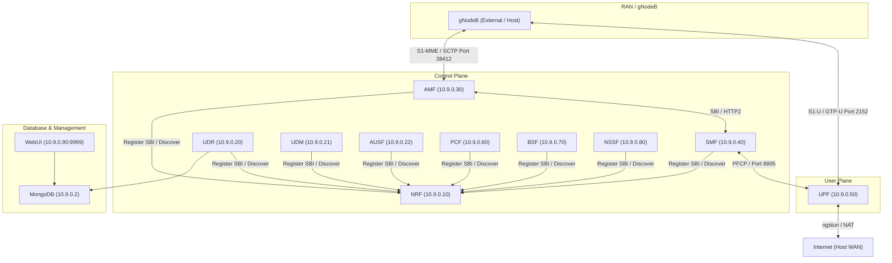

# Open5GS Deploy

A containerized, multi-service deployment of the **Open5GS** 5G Core (5GC) using **Docker** and **Docker Compose**. This repository isolates each Network Function (NF) into its own container with static IP mapping, paving the way for later migration to Kubernetes (K8s/Helm).

---

## Architecture

This deployment configures a custom Docker bridge network (`open5gs-net`) running on `10.9.0.0/24`. NFs are statically mapped to ensure seamless and reliable Service-Based Interface (SBI) routing, SCTP association, and GTP control/user plane routing.



---

## Features

- **Microservices-based**: Every Open5GS Network Function runs in its own container.
- **Optimized Multi-Stage Build**: A multi-stage Docker build that compiles Open5GS from source and discards compilation tools in the final runtime stage, keeping container images extremely lightweight.
- **Switchable Versions**: Easily build and switch between arbitrary Open5GS versions (e.g. `v2.7.2`, `v2.6.6`) by editing `OPEN5GS_VERSION` in the `.env` file.
- **Robust Networking**: Statically assigned IPv4 network configuration prevents DNS resolution issues for SCTP/GTP protocols.
- **Automated User Plane Setup**: The UPF entrypoint script automatically initializes the `ogstun` tunnel device and configures NAT (MASQUERADE) rules so that Connected Devices (UEs) can access the external internet.
- **Persistent DB & Logs**: MongoDB data is persisted via Docker volumes, and all network function logs are saved to the host `./logs/` folder.

---

## Prerequisites

1. **Docker and Docker Compose**:
   - Docker Engine >= 22.0.5
   - Docker Compose >= 2.14

2. **SCTP Kernel Module** (for AMF connectivity):
   Ensure that the SCTP kernel module is loaded on your host machine:
   ```bash
   sudo modprobe sctp
   ```

3. **TUN Kernel Module** (for UPF connectivity):
   Make sure the TUN driver is active:
   ```bash
   sudo modprobe tun
   ```

---

## Quick Start

### 1. Clone & Bootstrap
If you haven't already:
```bash
git clone <repository-url> open5gs-deploy
cd open5gs-deploy
```

### 2. Configure Environment Variables
Inspect and customize network parameters in the `.env` file (e.g., MCC, MNC, IP ranges):
```bash
cat .env
```

### 3. Build & Launch the Stack
Build the unified base container image and start all network functions in the background:
```bash
docker compose up --build -d
```

### 4. Verify Services are Running
Check container status:
```bash
docker compose ps
```

You can view real-time log outputs in the `./logs/` folder or inspect them via Docker logs:
```bash
docker compose logs -f amf
```

---

## Managing Subscribers via WebUI

Once all services are up, the WebUI is accessible from your browser:
* **URL**: `http://localhost:9999`
* **Default Username**: `admin`
* **Default Password**: `1423`

### Adding a Subscriber
1. Go to the **Subscriber** menu.
2. Click **Add Subscriber**.
3. Input the IMSI, K, OPC/OP, and APN config matching your SIM card / UE profile.
4. Select the slice parameters (**SST** and **SD**) matching your network settings (configured in `.env` / `amf.yaml`).
5. Save the subscriber.

---

## Stop & Clean Up

To bring down the entire stack and delete network configuration:
```bash
docker compose down
```

To also delete database volume (this resets subscriber profiles):
```bash
docker compose down -v
```
